# SurgeonAssist-Net: Towards Context-Aware Head-Mounted Display-Based Augmented Reality for Surgical Guidance

We present SurgeonAssist-Net: a lightweight framework making action-and-workflow-driven virtual assistance, for a set of predefined surgical tasks, accessible to commercially available optical see-through head-mounted displays (OST-HMDs).
- [Link to pre-print on arXiv](https://arxiv.org/abs/2107.06397)


*Note: Gif playback is at 1.5x speed.*


## Table of contents
- [Project setup](#project-setup)
- [Data](#data)
- [Training](#training)
- [Testing model accuracy](#testing-model-accuracy)
- [Training using other models](#training-using-other-models)
- [Evaluation](#evaluation)
- [Inference on the HoloLens 2](#inference-on-the-hololens-2)
- [Citation](#citation)

## Project setup
Folder setup for the project sample.
```
data/
... data_256/
... csv/

eval/

pytorch-sandbox/
... data/
... model/
... onnx-models/
... run/
... utils/
... weights/

unity-sandbox/
... HoloLens2-Machine-Learning/
... OpenCVRuntimeComponent/
```

## Data
Download the Cholec80 data, extract images from the videos and resize to prepare for training.
- Request access to the [Cholec80 dataset](http://camma.u-strasbg.fr/datasets), download the zip files then extract the zip folder to any location

### Format data for training
- First navigate to the `data/` directory and create a minimal virtualenv to run the extraction script
- Download [Python for Windows](https://www.python.org/getit/windows/) (tested with Python 3.7.9)

```
python -m virtualenv -p 3.7 venv
.\venv\Scripts\activate
pip install -r requirements.txt
```
- Begin extracting frames from the Cholec80 input videos at a downsampled resolution of `256 x 256` and temporal resolution of `1` frame per second (this will take a while)
```
python .\extract-frames.py --video_dir='F:/Data/cholec80/videos/' --out_dir='data_256' --img_size='256,256'
```

## Training
Includes the resources for data formatting, loading, training, and export of a deep learning model for the prediction of surgical tasks from input video frames.

### Run sample
- Ensure that the correct [CUDA](https://developer.nvidia.com/cuda-toolkit-archive) and [cuDNN](https://developer.nvidia.com/rdp/cudnn-archive) library versions are installed to support [PyTorch 1.8.2 LTS](https://pytorch.org/) (tested with CUDA 11.1)
- Download [Python for Windows](https://www.python.org/getit/windows/) (tested with Python 3.7.9)
- In the `pytorch-sandbox/` directory, create the virtual environment setup for training as below

```
python -m virtualenv -p 3.7 venv
.\venv\Scripts\activate

# For training on NVIDIA 3000 series GPUs (CUDA 11.1 support)
pip install torch==1.8.2+cu111 torchvision==0.9.2+cu111 torchaudio===0.8.2 -f https://download.pytorch.org/whl/lts/1.8/torch_lts.html

# For optimal inference on the HoloLens 2 - RECOMMENDED
pip install -f https://download.pytorch.org/whl/torch_stable.html torch===1.4.0 torchvision===0.5.0

# Install requirements
pip install -r requirements.txt
```
### Confirm data extraction
- Prior to training, we confirm that there are no files missing from the frame extraction with a simple utility script to compare the csv file contents with the data dir, run from the `pytorch-sandbox/` directory
```
python .\utils\verify-images.py
```
- The output of this script will point to any missing files which may have been corrupted during extraction

### Begin training
- From the `pytorch-sandbox/` directory, we can begin training the SurgeonAssist-Net framework with a sequence length of `10`
- To monitor training/validation accuracy/loss, a TensorBoard training log is output to the `runs/` folder
- At the end of each epoch, the model weights with the highest validation accuracy are saved to the `weights/` folder
- After completing training on the dataset, the model weights which achieved the highest accuracy on the validation set are selected for evaluation on the test set
```
python .\main.py --img_size='224,224' --seq=10 --epo=25 --batch_size=32
```

### Continue training with existing weights
- To continue training the SurgeonAssist-Net network from a prior weights checkpoint, include the `--ckpt` argument and specify the weights file
```
python .\main.py --img_size='224,224' --seq=10 --epo=25 --batch_size=32 --ckpt='weights\cholec80_256__feat_b0_lite__img_224__len_10__hsize_128__epo_18__train_0.993__val_0.901__best.pth'
```

## Testing model accuracy
- To test the accuracy of specific trained weights, we can give the name of the weights to the script as follows
- The model inference outputs are saved to a folder with the same name as the validation weights in the `results/` folder
    - The `ground_truth.txt` and `pred.txt` files contain the frame-wise predictions of the trained model on the test dataset
```
python .\main.py --img_size='224,224' --seq=10 --epo=25 --batch_size=32 --best_weights="weights\cholec80_256__feat_b0_lite__img_224__len_10__hsize_128__epo_18__train_0.993__val_0.901__best.pth"
```
- Once evaluation on the test set is complete, the raw accuracy will be printed to the console and inference results will be saved to the `results/` folder for further evaluation using the Matlab scripts discussed below

```
test_data_len: 98194
Test progress: 100.00 % [98194 / 98194]
Time: [10.0 m 42.94 s] Acc: [0.8525] Loss: [1.3152]
```

- A figure which shows the qualitative performance of the network weights on Video 41 of the Cholec80 test dataset relative to the ground truth predictions will also be displayed

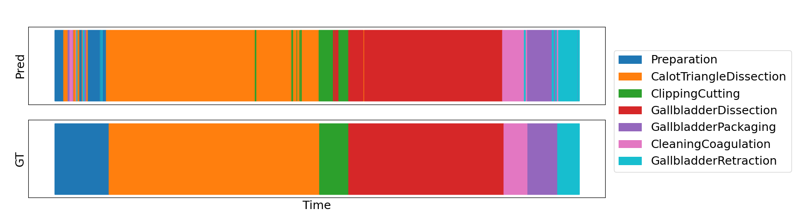

### Evaluating model accuracy and latency
- After assessing accuracy on the test set, the PyTorch inference time (latency) of the model is cataloged and reported in the command line using a single CPU core on a subset of the test dataset as below
```
Test progress: 100.00 % [500 / 500]
Average inference: [568.889 ms] Acc: [0.60]
``` 

### Model conversion to ONNX format
- Following the accuracy and latency measurement, the model weights are converted to [ONNX format](https://onnx.ai/) and the resulting ONNX model is saved to the `onnx-models/` folder 
- A sample model inference output from the PyTorch model and the resulting ONNX model is then reported to the command line using random input data (of the same size as the specified network input) 
- Ensure that the model output from the PyTorch and ONNX converted models are equivalent on the random input set

PyTorch model inference:
```
torch.Size([10, 7])
tensor([[-0.1540,  0.0836,  0.0781, -0.5180, -0.3604,  0.0418,  0.8781],
        ...
        [ 0.0172,  0.2130,  0.4172, -0.1952, -0.5844, -0.2214,  0.3679]])
```
ONNX converted model inference:
```
(10, 7)
[[-0.1539636   0.08358464  0.07811126 -0.51798964 -0.36045018  0.04183236 0.8781388 ]
...
 [ 0.01723573  0.21301626  0.4171564  -0.19517195 -0.584363   -0.22136632 0.36793017]]
```

### Comparing accuracy and latency of PyTorch and ONNX converted models
- Finally, the PyTorch model and ONNX model are used to comaparatively evaluate the latency and prediction accuracy on a subset of the test set
- The average inference times measured in PyTorch and ONNX are output to the command line
```
Test progress: 100.00 % [500 / 500]
Average PT inference: [574.898 ms] PT Acc: [0.60] Average ONNX inference: [107.329 ms] ONNX Acc: [0.60]
```

## Training using other models
We have included implementations of [SV-RCNet](https://ieeexplore.ieee.org/document/8240734) and [PhaseNet](https://.ieeexplore.ieee.org/abstract/document/7519080) as benchmarks for training and inference performance. Evaluation, ONNX conversion and latency assessment can be performed with these models with the same parameters as above (using the `main_benchmark.py` script) from the `pytorch-sandbox/` directory.
- To run training and evaluation with [SV-RCNet](https://ieeexplore.ieee.org/document/8240734) use the following parameters
```
python .\main_benchmark.py --img_size='224,224' --other_model='SV_RCNet' --seq=10 --epo=25 --batch_size=32
```
- To run training and evaluation with [PhaseNet](https://.ieeexplore.ieee.org/abstract/document/7519080) use the following parameters
```
python .\main_benchmark.py --img_size='224,224' --other_model='PhaseNet' --seq=1 --epo=25 --batch_size=32
```
- To continue training the network from a prior weights checkpoint, include the `--ckpt` argument and specify the weights file
```
python .\main_benchmark.py --img_size='224,224' --other_model='SV_RCNet' --seq=10 --epo=25 --batch_size=32 --ckpt='weights\xx.pth'
```
- To test the accuracy of specific trained weights, we can give the name of the weights to the script as follows
```
python .\main_benchmark.py --img_size='224,224' --other_model='SV_RCNet' --seq=10 --epo=25 --batch_size=32 --best_weights="weights\xx.pth"
```

## Evaluation 
Evaluation of the best model weights is first performed using PyTorch and the resulting ground truth and predictions are saved to text files in the `results/` folder (as described above). Detailed evaluation of these text files is performed in Matlab.
- Using matlab tool located in `eval/` folder, open the `Main.py` script
- Text files are written out from each model test run to the `pytorch-sandbox/results/` folder
- Change the model root folder parameter to point to the results folder (containing txt files) to be evaluated

```matlab
model_rootfolder = "F:/Data/surgeon-assist-net/pytorch-sandbox/results/cholec80_256__feat_b0_lite__img_224__len_10__hsize_128__epo_18/";
```
- After running the program using the default `ground_truth.txt` and `predictions.txt` results files, the accuracy metrics will be output to the console
- Using our best trained model weights (weights included in the `weights/` folder and model inference output in the `results/` folder), we get the following output from the evaluation script

```matlab
>> Main
model is :C:/git/surgeon-assist-net/pytorch-sandbox/results/cholec80_256__feat_b0_lite__img_224__len_10__hsize_128__epo_18/
================================================
                    Phase   Jacc   Prec    Rec 
================================================
              Preparation  58.92  79.35  70.79 
  CalotTriangleDissection  80.37  89.13  89.44 
          ClippingCutting  63.90  81.66  75.71 
    GallbladderDissection  80.35  89.44  89.29 
     GallbladderPackaging  68.13  75.99  90.90 
      CleaningCoagulation  61.79  75.61  79.69 
    GallbladderRetraction  59.99  79.26  74.26 
================================================
Mean jaccard: 67.64 +-  9.19
Mean accuracy: 85.81 +-  0.00
Mean precision: 81.49 +-  5.72
Mean recall: 81.44 +-  8.33
```

## Inference on the HoloLens 2

### About
- Optimal performance is achieved using version 19041 builds. In this sample I am using build 19041.1161 (Windows Holographic, version 20H2 - August 2021 Update) which can be downloaded from MSFT via the following [link](https://aka.ms/hololens2download/10.0.19041.1161) and installed using the [Advanced Recovery Companion](https://www.microsoft.com/en-ca/p/advanced-recovery-companion/9p74z35sfrs8?rtc=1&activetab=pivot:overviewtab)
- Tested with Unity 2019.4 LTS, Visual Studio 2019, and the HoloLens 2
- Input video frames of size `(1, 3, 224, 224)` and `(10, 3, 224, 224)` were tested for online inference `(NCWH)`
- Pretrained PyTorch weights of the SurgeonAssist-Net framework were formatted and exported to an ONNX model format for use 

### *Optional*: Build runtimes from source for ARM (PyTorch 1.8.2 LTS + Microsoft AI Machine Learning NuGet)
- Open the `OpenCVRuntimeComponent` solution in Visual Studio
- Using the Nuget package manager console, install the `OpenCV.Windows.3411.0.0.nupkg` NuGet package to the `OpenCVSandbox` project and `OpenCV.HoloLens.3411.0.0.nupkg` to the `OpenCVRuntimeComponent` project 
- Also included is the `microsoft.ai.machinelearning.1.8.1.nupkg` package which includes the relevant ONNX runtime requirements for loading the ONNX model and performing inference
```
Install-Package ..\OpenCV.Windows.3411.0.0.nupkg -ProjectName OpenCVSandbox
Install-Package ..\microsoft.ai.machinelearning.1.8.1.nupkg -ProjectName OpenCVSandbox
Install-Package ..\OpenCV.HoloLens.3411.0.0.nupkg -ProjectName OpenCVRuntimeComponent
```
- `OpenCVSandbox` provides a testing platform to evaluate the normalization of a sample input image and debug ONNX model outputs
- `OpenCVRuntimeComponent` replicates the `OpenCVSandbox` sample in its normalization of sample input, but uses the Universal Windows Platform and can be built to `.winmd` and `.dll` files which are used for the HoloLens 2 app
  - Output build directory `OpenCVRuntimeComponent/ARM/(Release/Debug)/OpenCVRuntimeComponent/`
- For use in Unity, copy the files in the output build directory above to the `unity-sandbox/HoloLens2-Machine-Learning/Assets/Plugins/ARM/` folder

### *Optional*: Build runtimes from source for ARM64 (PyTorch 1.4)
- The `microsoft.ai.machinelearning.1.8.1.nupkg` component does not have support for ARM64 operation currently
- If using ARM64, use the default `Windows.AI.MachineLearning` libraries instead of the `Microsoft.AI.MachineLearning` which are included in the Nuget package described in the prior step
  - **ARM64 and the `Windows.AI.MachineLearning` libraries will result in better inference speeds at the cost of requiring an older version of PyTorch (1.4) and ONNX Opset (<=9) for training and ONNX model export (meaning the new 3000 series NVIDIA GPUs are not supported)**
- Open the `OpenCVRuntimeComponent` solution in Visual Studio
```
Install-Package ..\OpenCV.HoloLens.3411.0.0.nupkg -ProjectName OpenCVRuntimeComponent
```
- `OpenCVRuntimeComponent` can be built to `.winmd` and `.dll` files which are used for the HoloLens 2 app
  - Output build directory `OpenCVRuntimeComponent/ARM64/(Release/Debug)/OpenCVRuntimeComponent/`
- For use in Unity, copy the files in the output build directory above to the `unity-sandbox/HoloLens2-Machine-Learning/Assets/Plugins/ARM64/` folder

### *Optional*: Build configurations
The build configurations for each of the projects are as follows:

|   | OpenCVSandbox | OpenCVRuntimeComponent |
|---|---|---|
| Platform | `x64` (Debug/Release)  |  `ARM/ARM64` (Debug/Release) |   
| Output  | To console window  | To build dir (`.winmd` `.dll` `.lib`)  |   
|   |   |   |   

### *Optional*: Model inference debugging
The `OpenCVSandbox` project can be used to evaluate the output of the bound ONNX model and compared to the model output of the equivalent PyTorch model. It is important to make sure that the ONNX converted model matches the PyTorch model, and that the same normalizing transformations are applied to input images to ensure that we can replicate our results.

- Upon running the sample, a console window will appear and show the following statistics of the normalized input image
```
openCvImage.shape = [224 x 224]
openCvImage max = 4.36581
openCvImage min = -1.98047
openCvImage avg = 0.106211
```

- The original and center cropped, normalized images will appear in separate OpenCV imshow windows as

video41_25 `(3, 256, 256)`  |  video41_25 normalized `(3, 224, 224)`
:-------------------------:|:-------------------------:
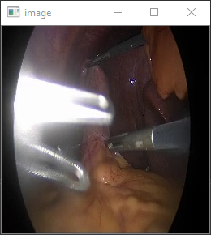  |  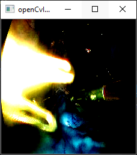

- The ONNX model outputs for the sample input image are then printed to the console window. For the included model with a sequence length of `1` (`b0_lite_1.onnx`) we get
```
outputs: [[0.15243995, 5.9982438, -0.38196307, -4.1016378, 0.98468649, 1.8998184, -4.383872]]
```
### *Optional*: Comparing C++ ONNX results to PyTorch and ONNX results in Python
To compare the C++ ONNX inference results to that of the PyTorch model and ONNX model in Python, we perform the following.
#### 1. Testing model inference in PyTorch using the following command (and the print statement at line 77 of `test.py`) 
```
python .\main.py --img_size='224,224' --seq=1 --epo=25 --batch_size=1 --best_weights="weights\cholec80_256__feat_b0_lite__img_224__len_1__hsize_128__epo_20__train_0.957__val_0.811__best.pth"
```
- We get the following output for the first sample of the test dataset (`video41_25`)
```
local_output: tensor([[ 0.1532, 5.9982, -0.3814, -4.1019, 0.9841, 1.8995, -4.3837]], device='cuda:0')
```
#### 2. Testing model inference in Python with PyTorch and OpenCV transforms using ONNX with the `scratchpad.py` script
```
python .\scratchpad.py --onnx_model_name="onnx-models/PyTorch_1.8.2_LTS/b0_lite_1.onnx" --seq=1
```
- The console output will give similar image statistics of the normalized input (as above) for normalization in PyTorch and OpenCV as well as the accompanying images
- It is important that the OpenCV normalization matches what is performed in PyTorch to ensure that we receive the correct inference results when running online on the HoloLens 2
```
ptImage.shape = (3, 224, 224)
ptImage max = 4.3658137
ptImage min = -1.980472
ptImage avg = 0.106210634

openCvImage.shape = (1, 3, 224, 224)
openCvImage max = 4.3658137
openCvImage min = -1.9804721
openCvImage avg = 0.10621054
```

video41_25 `(3, 256, 256)`  |  video41_25 normalized OpenCV `(3, 224, 224)` |  video41_25 normalized PyTorch `(3, 224, 224)` 
:-------------------------:|:-------------------------:|:-------------------------:
  |  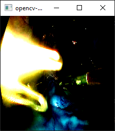|  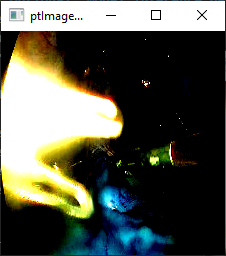

- We get the following matching outputs for the first sample of the test dataset (`video41_25`)
```
outputs opencv normalized:  [array([[ 0.1524404, 5.998244, -0.3819608, -4.101637, 0.9846859, 1.8998177, -4.383874 ]], dtype=float32)]

outputs pytorch normalized:  [array([[ 0.15243927, 5.998246, -0.3819655, -4.1016374, 0.9846873, 1.8998195, -4.3838735 ]], dtype=float32)]
```

#### 3. Evaluating model inference in Python with OpenCV and ONNX with the `scratchpad-video.py` script
```
python .\scratchpad-video.py --onnx_model_name="onnx-models/PyTorch_1.8.2_LTS/b0_lite_10.onnx" --seq=10
```
- A sample segment of `Video41` of the Cholec80 test partition is provided along with the ground truth labels
- Qualitative performance and inference speed assessment using OpenCV and ONNX in a Python script
- Queue structure to evaluate the performance of the provided ONNX model with a sequence length of 10 input frames
- As in the below image, the current phase prediction (and latency in milliseconds) is shown relative to the ground truth prediction

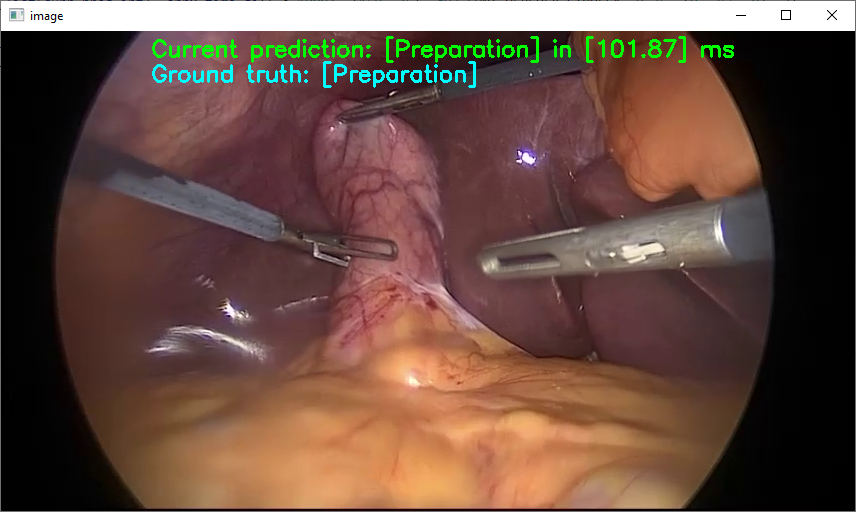

### Deploy and run the sample on the HoloLens 2
- *Optional*: If `OpenCVRuntimeComponent` was built from source, copy `.winmd`, `.dll` and `.lib` files from `OpenCVRuntimeComponent/[ARM/ARM64]/(Release/Debug)/OpenCVRuntimeComponent/` to the Unity plugins directory `unity-sandbox/HoloLens2-Machine-Learning/Assets/Plugins/[ARM/ARM64]/` folder
- Open `HoloLens2-Machine-Learning` in Unity
- Switch build platform to `Universal Windows Platform`, select `HoloLens` for target device, and `ARM/ARM64` as the target platform depending on which PyTorch version you have used for training 
  1. PyTorch 1.8.2 LTS: Require `ARM` + Microsoft AI Machine Learning NuGet for HoloLens 2 inference to work
      - In `NetworkModel.cs` and `model.cs`, ensure that you are using the correct library from the Microsoft AI Machine Learning Nuget with the statement: `using Microsoft.AI.MachineLearning;`
  2. PyTorch 1.4: Require `ARM64` for HoloLens 2 inference to work **(optimal performance)**
      - In `NetworkModel.cs` and `model.cs`, ensure that you are using the correct library from the default Windows AI Machine Learning Nuget with the statement: `using Windows.AI.MachineLearning;`
- Build Visual Studio project and open the `.sln` file
- If PyTorch 1.8.2 LTS was used for ONNX export:
  - Copy the `b0_lite_1.onnx` from the `pytorch-sandbox/onnx-models/PyTorch_1.8.2_LTS` folder to the `Builds/WSAPlayer/ArUcoDetectionHoloLensUnity/Assets` folder
  - Your ONNX model should appear as below (using the [WinMLDashboard tool](https://github.com/microsoft/Windows-Machine-Learning/tree/master/Tools/WinMLDashboard)) with Opset version <=9 and irVersion = 6. This ONNX model will result in a runtime error using the WinMLDashboard tools `Run` utility, meaning that it requires `ARM` configuration for building on the HoloLens 2 and the additional `Microsoft.AI.MachineLearning` NuGet package

  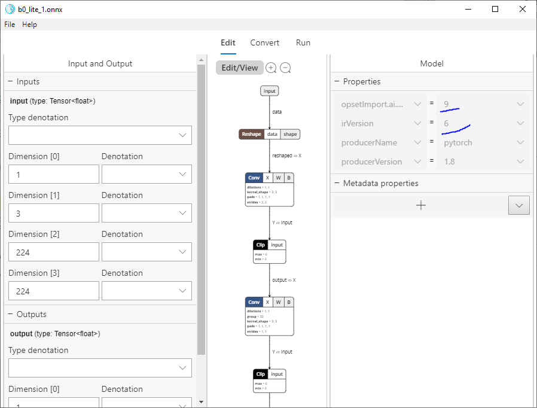

- If PyTorch 1.4 was used for ONNX export:
  - Copy the `b0_lite_1.onnx` from the `pytorch-sandbox/onnx-models/PyTorch_1.4` folder to the `Builds/WSAPlayer/ArUcoDetectionHoloLensUnity/Assets` folder
  - Your ONNX model should appear as below (using the [WinMLDashboard tool](https://github.com/microsoft/Windows-Machine-Learning/tree/master/Tools/WinMLDashboard)) with Opset version <=9 and irVersion = 4. If the ONNX model runs without errors using the WinMLDashboard tools `Run` utility, it will run on the HoloLens 2 using the `Windows.AI.MachineLearning` default libraries
  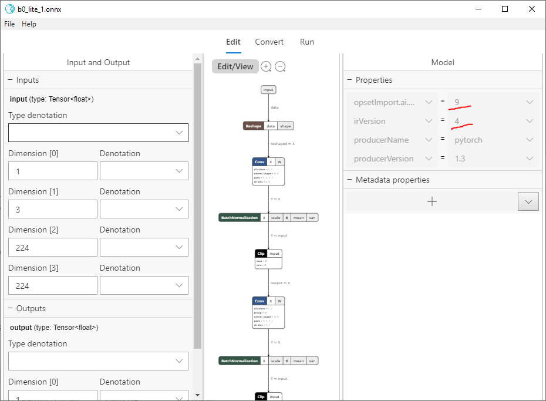
- Import to Visual Studio project as an existing file, place in the assets folder
- In the asset properties window (as below), confirm that the `Content` field has its boolean value set to `True`. This enables the `ONNX` model to be loaded at runtime from the Visual Studio assets folder

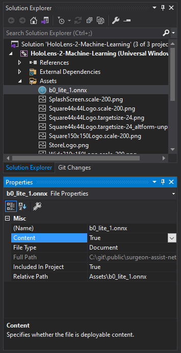

- Build and deploy the `.sln` to the HoloLens 2. An on-screen text window will output information as to the current model prediction label, prediction probability, and inference time 
  - Alternatively, the included `.appx` package can be installed directly to the HoloLens 2 device using the device portal 
  - `.appx` is located in the `unity-sandbox/HoloLens2-Machine-Learning/Builds/WSAPlayer/AppPackages/HoloLens-2-Machine-Learning/HoloLens-2-Machine-Learning_1.0.1.0_ARM_Test/` folder

### Images from online inference
#### Using `PyTorch_1.8.2_LTS/b0_lite_1.onnx`
- The below image was recorded using the HoloLens 2 Device Portal capture window while viewing Video 41 of the Cholec80 dataset (~35 seconds in) and using the `PyTorch_1.8.2_LTS/b0_lite_1.onnx` model for inference. This sample was build using `ARM` and the `Microsoft.AI.MachineLearning` libraries with an ONNX model exported from PyTorch 1.8.2 LTS
- Inference speeds of roughly 800 - 1200 ms are typical

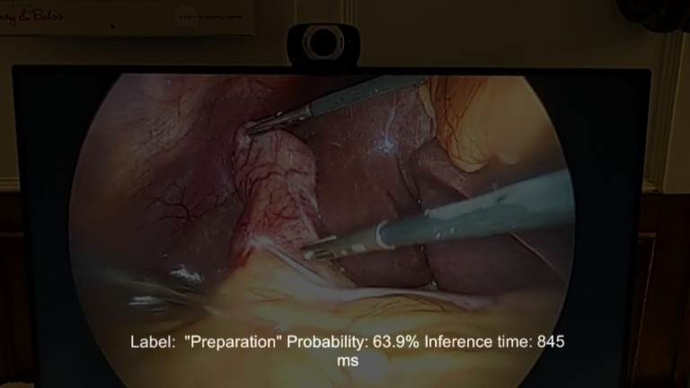

#### Using `PyTorch_1.4/b0_lite_1.onnx`
- This second image was recorded using the HoloLens 2 Device Portal capture window while viewing Video 41 of the Cholec80 dataset (~35 seconds in) and using the `PyTorch_1.4/b0_lite_1.onnx` model for inference. This sample was build using `ARM64` and the default `Windows.AI.MachineLearning` libraries with an ONNX model exported from PyTorch 1.4 - notice the reduction in required inference time of this approach
- Inference speeds of roughly 200 - 350 ms are typical

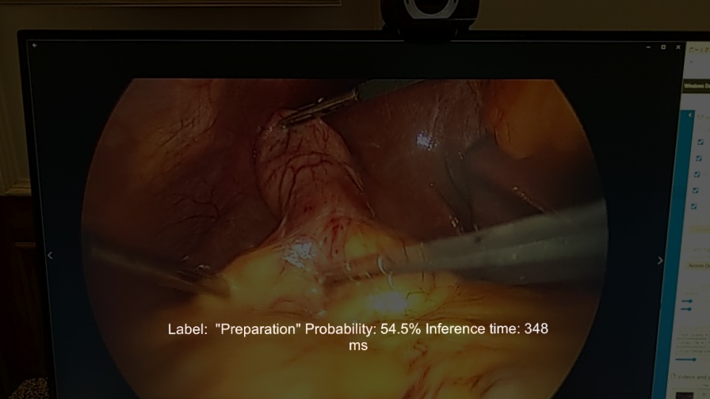

## Citation
If you found this code repo useful, please consider citing the associated publication:
```
@inproceedings{doughty2021surgeonassist,
    author={Doughty, Mitchell and Singh, Karan and Ghugre, Nilesh R.}
    title={SurgeonAssist-Net: Towards Context-Aware Head-Mounted Display-Based Augmented Reality for Surgical Guidance},
    booktitle={Medical Image Computing and Computer Assisted Intervention -- MICCAI 2021},
    year={2021},
    publisher={Springer International Publishing},
    pages={667--677},
    isbn={978-3-030-87202-1}
}
```
